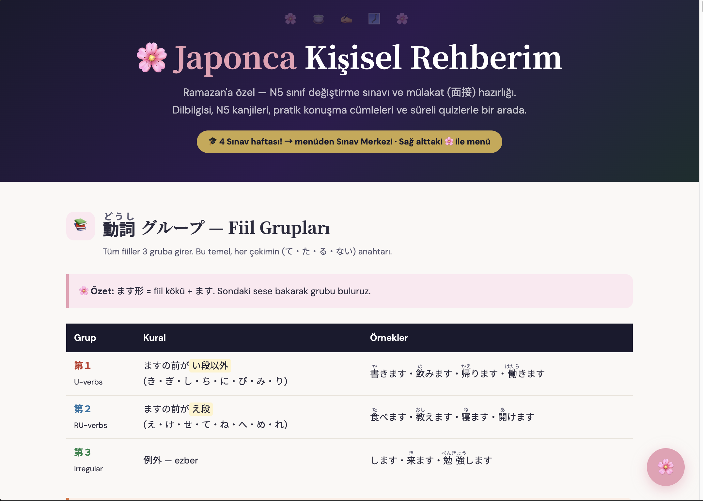
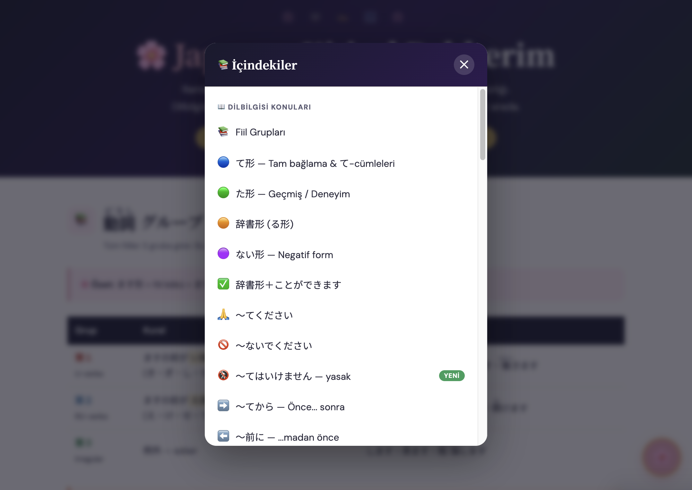
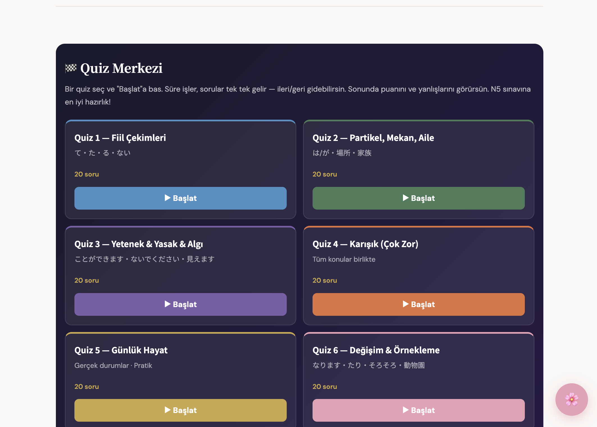
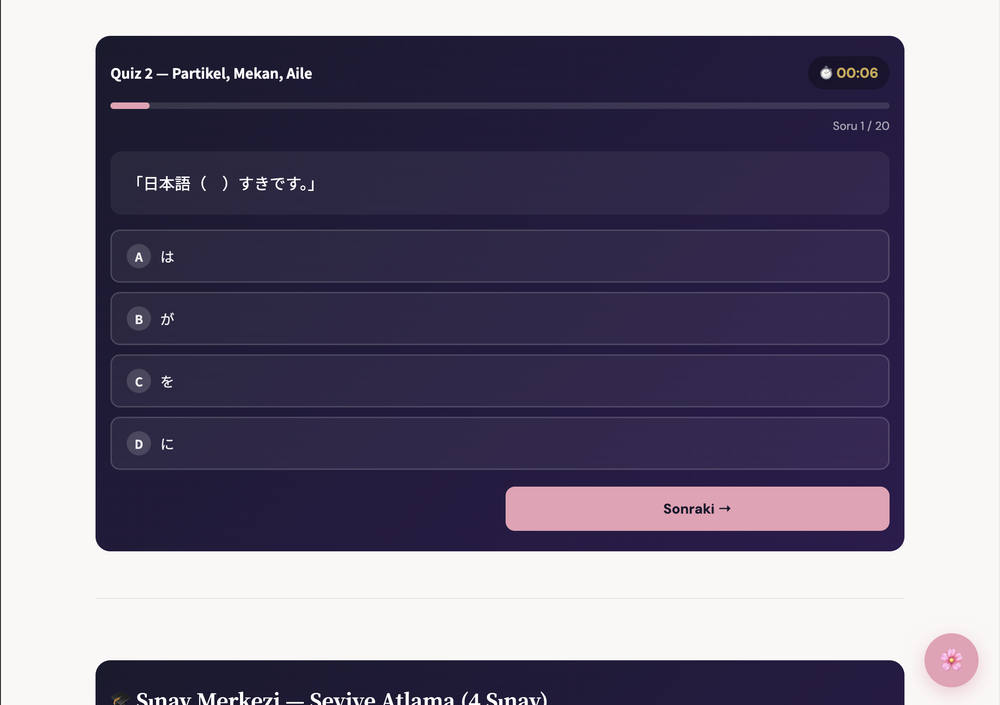
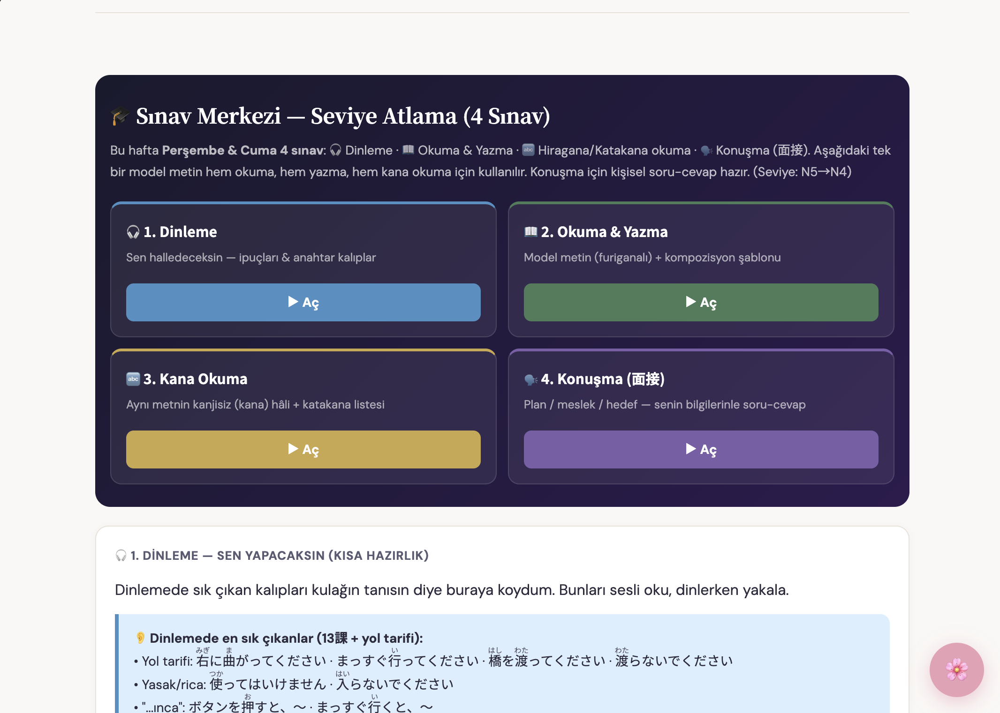

# 🌸 Nihongo Grammar — Personal Japanese Study Guide (N5 & N4)

A single-file, offline-friendly Japanese study guide built for self-learning and **JLPT** preparation. It brings grammar, kanji, vocabulary, and interactive quizzes together in one place — no installation, no account, just open the HTML file in a browser.

Explanations are written in **Turkish**, with **romaji** and example sentences on every grammar point. All kanji include **furigana** readings.

## 🎯 Purpose & Goals

- **Learn Japanese grammar from N5 to N4** in a clear, structured, mobile-friendly way.
- **Self-study first:** every rule comes with 5–6 example sentences (Japanese + romaji + Turkish) so you can study from real examples, not just definitions.
- **Get exam-ready:** practice actively and prepare for the **JLPT** and school level-up exams.

## 📚 What's Inside

| File | Level | Theme |
| --- | --- | --- |
| `japanese-guide-12.html` | **N5** (latest) | 🌸 Pink |
| `japanese-guide-11.html` | N5 (previous version) | 🌸 Pink |
| `n4.html` | **N4** — full grammar set (46 topics) | 🌻 Yellow |

Each guide contains:
- **Grammar sections** — every point with formation rules, comparison boxes, and 5–6 example sentences.
- **Kanji lists** — with furigana readings, meanings, and example words.
- **Vocabulary** — grouped by theme.
- **Quiz Center** and **Exam Center** (see below).

## 🧭 Quiz Center vs. Exam Center

The two centers have **different goals** — use them for different things:

- **🏁 Quiz Center — for self-improvement.**
  Short, topic-based quizzes to practice and reinforce what you just learned. The goal is **personal progress**: check your understanding, catch mistakes early, and build confidence one topic at a time. Every answer comes with an explanation.

- **🎓 Exam Center — for JLPT preparation.**
  Timed, exam-style quizzes that mix multiple topics, kanji readings, and vocabulary — plus a full mixed "achievement test". The goal is **exam readiness**: simulate real test conditions and prepare for the **JLPT** (and school level-up exams).

## 🖼️ Screenshots

**Home / Hero**

**Navigation menu (table of contents)**

**Quiz Center — practice for self-improvement**

**Exam Center — JLPT preparation**

## 🛠️ Tech Stack

- **HTML5** — single self-contained file per guide.
- **CSS3** — custom properties (theming), Flexbox & Grid, fully responsive.
- **Vanilla JavaScript** — the interactive quiz engine (timer, progress bar, per-question navigation, scored results with explanations). No frameworks, no build step.
- **Google Fonts** — Noto Sans JP / Noto Serif JP / DM Sans.
- **`<ruby>` furigana** — native HTML ruby annotations for kanji readings.

No dependencies, no bundler — the app runs entirely in the browser.

## 🚀 How to Use

1. Clone or download this repository.
2. Open any guide (`japanese-guide-12.html` for N5, `n4.html` for N4) in your browser.
3. Tap the floating 🌸 / 🌻 button (bottom-right) to open the menu and jump to any topic.
4. Study the grammar → practice in the **Quiz Center** → test yourself in the **Exam Center**.

---

*A personal learning project — 頑張ろう！ 🇯🇵*
